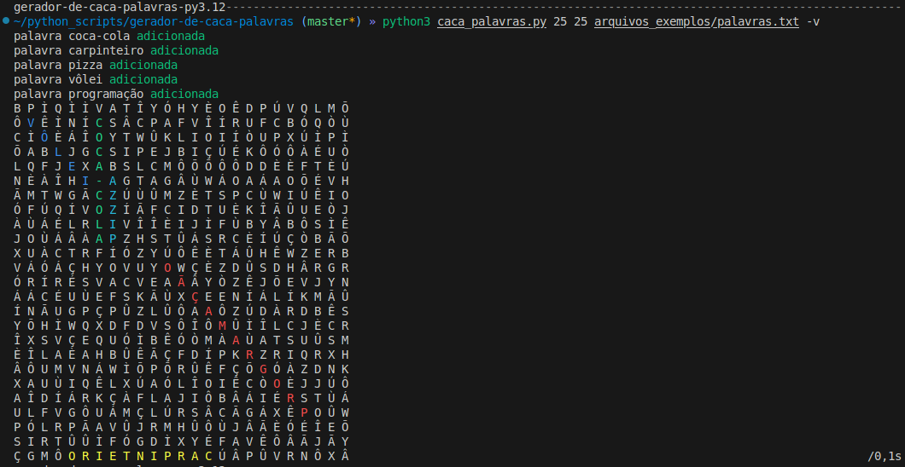

# gerador-de-caça-palavras
Um programinha que gera um caça-palavras

## Imagem ilustrativa:

## Como rodar?
`python3 caca_palavras.py`

## Flags e argumentos:
### flags:
flag | função
--- | ---
`-v --verboso` | mostrar verbosidade no que o programa está fazendo.
`--colorido --nao-colorido` | exibe o caça-palavras resolvido com cores ou não.

### argumentos:
comando | função
--- | ---
`altura` | define a altura da tabela.
`largura` | define a largura da tabela.
`arquivo` | define o local do arquivo que contém as palavras a serem inseridas.

## Regras para o arquivo de texto com palavras para serem inseridas:
- uma palavra por linha

## Informações extras:
### bibliotecas externas usadas:
- click
- rich
- poetry
- flake8, pylint (na ide)
- mypy (na ide)
- radon (no sistema)